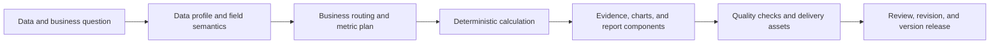

# Asteria Analyst

> From one spreadsheet to a set of reviewable delivery assets.

Asteria Analyst is a local-first data-to-decision delivery workbench for business analysis, operations review, research, and consulting delivery. It helps a team turn CSV and Excel data into an analysis path, calculation evidence, report assets, and a revision history that can be reviewed and reused.

The product does not present AI as a replacement for analysis. AI is used for field semantics, business context, and planning; final report numbers are produced by a deterministic execution layer and tied to evidence.

## Who It Is For

| Role | Typical need | What Asteria provides |
| --- | --- | --- |
| Business or operations lead | Turn a recurring business question into a clear decision package | Structured analysis, management-facing delivery, and release checks |
| Analyst | Inspect data, select a method, and verify conclusions | Data profiling, Analysis Lab, method-level outputs, and exports |
| Review or delivery owner | Make changes without losing context or evidence | Annotations, review artifacts, file comparison, and revision workspace |
| Engineering or governance partner | Understand how a result was produced | Deterministic calculations, manifests, trace artifacts, and documented boundaries |

## The Delivery Model

The result is more than a single PDF. Depending on the selected workflow and its successful checks, Asteria can produce reviewable report content, tables, charts, structured data, manifests, and versioned revision materials.

## What Is Included

| Workspace | Route | Use it for |
| --- | --- | --- |
| Home | `/` | Product navigation, local status, and optional provider settings |
| Formal analysis | `/analysis` | Data intake, business goal, controlled analysis, and formal-report preview |
| Analysis Lab | `/lab` | Exploratory methods, method combinations, and method-level deliverables |
| Method guide | `/lab/method-guide` | Finding suitable methods by question, variables, and method family |
| Revision center | `/revision` | Choosing an existing report for follow-up work |
| Revision workspace | `/revision/workspace` | Annotations, review artifacts, differences, and version publishing |

## Start Locally

### Source checkout

This path is for developers and users who have Python and Node.js installed.

1. Install Python 3.11 or later and Node.js 20.9 or later.
2. Clone or extract this repository.
3. On Windows, double-click `start-asteria.cmd` in the repository root.
4. Keep an internet connection available on the first run so Python and frontend dependencies can be installed.
5. The launcher verifies the backend and frontend, opens `/analysis`, and writes startup logs to `logs/launcher/`.

The launcher normally uses local ports 8000 and 3000. If one of those default ports is occupied by another application, it selects a nearby available local port and prints the actual URL.

### Windows portable package

The release package is intended for Windows users who do not want to install Python or Node.js. When the repository owner publishes a GitHub Release, download its `AsteriaAnalyst-portable.zip` asset, extract it, and double-click `start-asteria.bat`.

The portable package includes a bundled runtime and opens the local analysis workspace. It is still a local, single-user application: extracting a ZIP does not make it a hosted web service.

For detailed first-run instructions and troubleshooting, read [Getting Started](docs/getting-started.zh-CN.md).

## A Five-Minute First Analysis

1. Start Asteria and open the printed local address, normally `http://127.0.0.1:3000/analysis`.
2. Load the included sample file `examples/revenue-smoke.csv`, or choose a small non-sensitive CSV/XLSX file of your own.
3. Check the data profile before running anything: sheet, row grain, field types, missing values, units, and time range.
4. State the business question and intended reader. Select the formal workflow only when you need its controlled report path; use Analysis Lab for exploration and method comparison.
5. Review the outputs in this order: method or calculation result, table/chart evidence, written summary, then downloadable assets.

The full workflow is documented in [User Guide](docs/user-guide.zh-CN.md).

## Trust and Release Rules

A formal management report must follow the controlled chain below:

`raw data -> DataProfileService -> AIFieldSemanticMapper -> AIBusinessContextRouter -> AIMetricDerivationPlanner -> DeterministicMetricExecutor -> EvidenceValidator -> ReportBindingLayer -> FormalPDFReleaseGate -> management_report.pdf`

For a formal report:

- AI outputs must have persistent trace artifacts and pass schema validation.
- Final numeric values must come from deterministic execution, not model-generated text.
- Evidence validation and the formal release gate must pass.
- A final quality score below 90 blocks `management_report.pdf`; the system may produce a `debug_report` for diagnosis instead.

Analysis Lab is intentionally more exploratory. It is useful for selecting and comparing methods, but it is not a way to bypass formal-report controls. See [Report Integrity](docs/report-integrity.zh-CN.md) and the [mandatory AI chain](docs/architecture_ai_mandatory_chain.md).

## Data, Privacy, and Network Boundary

- Basic CSV/Excel work can be performed locally and does not require an external model provider.
- If you explicitly enable AI-assisted reporting or revision, relevant field context, report context, or uploaded workbook/PDF content may be sent to the OpenAI-compatible provider configured in your local environment. De-identify sensitive, personal, regulated, or contract-restricted data first and follow your organization’s policy.
- Keep API keys only in the local `.env` file. The repository ignores `.env`, uploaded data, generated reports, logs, runtime state, and portfolio material.
- The default product is designed for loopback-only, single-user use. Do not expose it directly to the public Internet or a shared network.

Read [Deployment Boundaries](docs/deployment-boundaries.md) and [SECURITY.md](SECURITY.md) before attempting any non-local deployment.

## Documentation

- [Public project introduction](docs/public-project-introduction.zh-CN.md)
- [Getting started](docs/getting-started.zh-CN.md)
- [Detailed user guide](docs/user-guide.zh-CN.md)
- [Formal report integrity](docs/report-integrity.zh-CN.md)
- [Mandatory AI release architecture](docs/architecture_ai_mandatory_chain.md)
- [Contributing](CONTRIBUTING.md)
- [Security policy](SECURITY.md)

## Public Repository Scope

This repository is prepared to publish source code, tests, launch scripts, examples, and public technical documentation. It intentionally excludes customer material, uploaded datasets, generated reports, runtime sessions, logs, caches, credentials, and the private portfolio PDF used as writing reference.

The repository may be publicly viewable before it is legally reusable. No open-source license has been selected yet; until the owner adds a `LICENSE` file, do not copy, modify, or redistribute the project.
