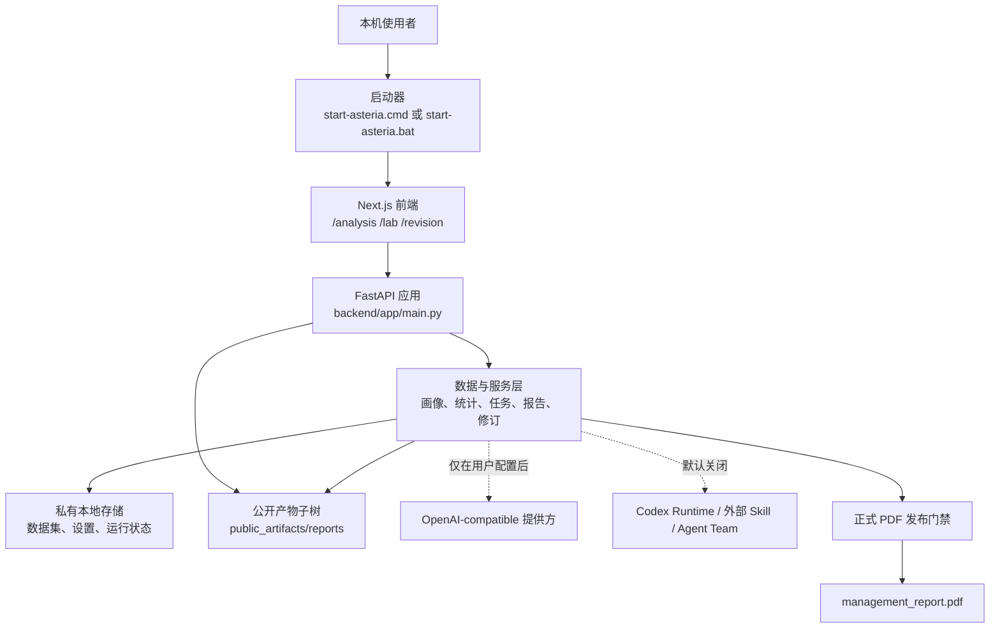
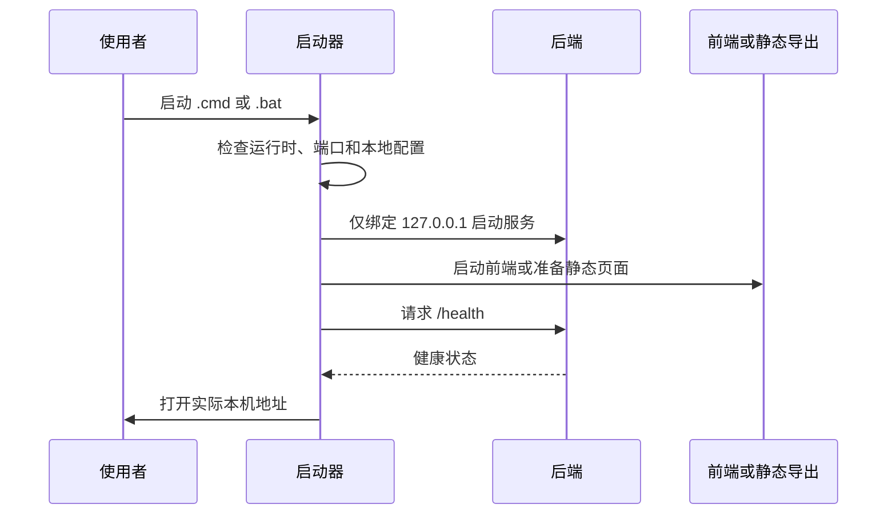

# Asteria Analyst 系统架构

本文面向开发者、运维者、审计者和需要理解交付可信边界的报告负责人。它描述当前公开版本的本机架构事实，并列出公网多租户部署所需的独立能力。

## 1. 设计目标与适用范围

### 设计目标

- 在 Windows 本机完成数据导入、字段画像、统计分析、报告资产管理和报告修订。
- 让业务问题、字段语义、计算结果、图表和报告资产之间保留可追溯关系。
- 允许 AI 协助理解字段、选择业务路由和规划指标，同时把正式数值留给确定性执行器。
- 把普通探索结果与可发布的正式管理报告分开处理。
- 将默认服务绑定在 `127.0.0.1`，保护上传数据和本机运行状态。

### 部署范围

- 当前版本提供本机单用户工作台；账户、租户隔离、权限模型和审计留存需由独立平台层提供。
- 生产公网部署需完成反向代理、身份认证、授权、网络隔离、监控与运维设计。
- HTTP 调用范围限于已注册的受控路由和经过验证的输入。
- 正式经营数字由确定性执行器生成和校验；语言模型用于字段理解、业务路由和指标规划。

## 2. 总体拓扑

前端通常运行在本机 `127.0.0.1:3000`，后端健康检查通常为 `127.0.0.1:8000/health`。便携版由后端直接托管前端静态导出文件，默认监听 `127.0.0.1:8787`。启动器在默认端口已被占用时可能选择邻近端口，因此运行时以启动窗口打印的实际地址为准。

## 3. 目录与责任边界

| 路径 | 主要责任 | 存放规则 |
| --- | --- | --- |
| `frontend/` | Next.js 页面、交互、客户端状态和静态构建 | 存放可公开的客户端配置；密钥与后端私有路径留在服务端。 |
| `backend/app/main.py` | FastAPI 应用、当前注册的 HTTP 路由、回退静态页面 | 保持路由编排与回退入口，业务计算由服务层处理。 |
| `backend/app/models.py` | 请求/响应相关的 Pydantic 数据模型 | 定义当前注册路由使用的模型和字段。 |
| `backend/app/services/` | 数据导入、统计、AI 编排、报告、修订、运行时服务 | 在服务层完成字段理解、业务路由、指标规划与渲染前绑定。 |
| `backend/tests/` | 服务、发布默认值和回归验证 | 使用脱敏样本与稳定测试工件。 |
| `workspace/storage/` | 源码模式下的本地运行数据 | 真实业务文件保留在私有本机目录。 |
| `docs/` | 用户、开发、API、安全和发布说明 | 记录可由当前代码验证的行为和版本范围。 |
| `scripts/` | 质量检查、实验辅助、便携版构建 | 提供显式、本机可控的构建和辅助入口。 |

## 4. 前端工作区与后端服务

| 工作区 | 主要页面路由 | 后端职责 | 典型输出 |
| --- | --- | --- | --- |
| 分析工作区 | `/`、`/analysis` | 数据上传、工作表选择、画像、受控统计、智能报告任务 | 数据集摘要、表格、图表、报告任务和下载资产。 |
| Analysis Lab | `/lab`、`/lab/method-guide` | 方法目录、字段角色、运行实例、PDCA、方法卡 | 可复核的方法结果和实验资产。 |
| 修订中心 | `/revision` | 报告目录、筛选、历史会话 | 可进入的报告和修订入口。 |
| 修订工作区 | `/revision/workspace` | 消息、事件、附件、批注、差异、版本发布 | 本地修订会话及其资产。 |

前端负责呈现、收集用户意图和展示状态。后端保管密钥、执行证据校验、处理权限开关，并决定正式 PDF 的放行状态。

## 5. 数据与存储边界

`backend/app/services/path_service.py` 定义了运行期路径：

| 运行模式 | 根目录 | 说明 |
| --- | --- | --- |
| 源码运行 | `<仓库>/workspace/storage` | 默认本地数据根目录。 |
| 冻结/便携运行 | `%APPDATA%\AsteriaAnalyst` | 默认用户数据根目录。 |
| 显式覆盖 | `ASTERIA_DATA_DIR` | 使用者指定的本机数据目录。 |

在上述根目录下，数据集、历史报告、业务背景、运行任务和 `settings.json` 均为私有运行数据。`main.py` 将 `public_artifacts/` 子树显式挂载到 `/storage`，供本机界面访问已选定的可下载产物；其他存储目录保持私有。公开产物目录收录经过检查、可由界面访问的内容。

## 6. 核心数据流

### 6.1 启动与健康检查

源码启动器会准备 Python 虚拟环境、前端依赖和生产构建；构建阶段出现问题时，脚本会使用真实的 Next.js 开发服务继续提供界面。便携包使用包内运行时与 `backend/run_desktop.py`，包内即包含所需的 Python 和 Node.js 运行时。

### 6.2 数据导入到受控分析

1. 使用者上传 CSV、TSV、Excel 或 Stata 文件，或选择已有数据集。
2. 后端保存数据集元数据并返回工作表、字段类型、缺失值、行列规模和抽样预览等画像信息。
3. 使用者确认行粒度、单位、时间范围、业务问题和目标对象。
4. 前端调用统计、自动分析或 Lab 路由；后端根据请求模型执行受支持的方法并生成结构化结果。
5. 使用者先审阅计算结果、表格和图表，再把结论用于报告或后续修订。

数据画像为行粒度、字段含义、单位和时间口径的业务确认提供结构化依据；业务责任人据此完成口径确认。

### 6.3 正式管理报告链

正式 `management_report.pdf` 由项目强制链生成。页面预览、手工改名和文件复制用于审阅或整理，不构成正式发布依据：

| 阶段 | 责任 | 发布要求 |
| --- | --- | --- |
| `DataProfileService` | 识别工作表、字段、类型、缺失和候选分析结构。 | 为后续语义、路由和指标规划提供统一的数据画像。 |
| `AIFieldSemanticMapper` | 生成字段语义映射和 trace。 | 在正式报告绑定前形成可审计字段语义。 |
| `AIBusinessContextRouter` | 将语义与业务背景连接为合适的路线，并保存 trace。 | 根据行业和场景形成可审计的业务路由。 |
| `AIMetricDerivationPlanner` | 规划直接、推导、代理和不支持指标。 | 提供计算计划，最终数值交由确定性执行器生成。 |
| `DeterministicMetricExecutor` | 在可重复执行的路径中计算数值。 | 为正式数字提供可复算的来源。 |
| `EvidenceValidator` | 验证 schema、计算和证据绑定。 | 完整证据和有效校验结果进入正式发布门禁。 |
| `ReportBindingLayer` | 将已验证的内容装配为可渲染报告。 | 渲染器消费已绑定内容，字段理解和事实校验在此前完成。 |
| `FormalPDFReleaseGate` | 综合 trace、schema、证据和质量分给出放行/阻断结果。 | 质量分达到 `90` 且必需项齐备时放行。 |

更多操作与审阅细节见 [正式报告可置信机制](report-integrity.zh-CN.md)。

### 6.4 报告修订

修订工作区围绕既有报告建立会话。消息、附件、批注、事件流、文件列表和差异通过同一报告/会话上下文定位，保证修订资产可追溯。高权限 Runtime 会话 API 由环境开关管理，见 [配置与安全](security-deployment.zh-CN.md)。

## 7. AI、Runtime 与外部扩展边界

| 能力 | 默认状态 | 前提 | 主要风险 |
| --- | --- | --- | --- |
| 本地 CSV/Excel 数据查看和基础统计 | 默认可用 | 支持的数据和方法 | 数据质量、方法适配和解释错误。 |
| AI 字段语义/业务路由/报告增强 | 可选配置 | 本机 AI 提供方配置和数据授权 | 相关上下文可能发送给已配置提供方。 |
| Codex Runtime API | 默认关闭 | `ASTERIA_ENABLE_CODEX_RUNTIME_API=1`，以及相应本机运行条件 | 高权限本地执行与运行资产泄露。 |
| 外部 Skill、Agent Team 导入/挂载 | 默认关闭 | `ASTERIA_ENABLE_LOCAL_SKILL_INSTALLER=1` | 导入不可信内容或扩大本机执行面。 |
| 非沙箱 Codex 执行 | 默认关闭 | 额外的 `ASTERIA_ALLOW_UNSANDBOXED_CODEX_RUNTIME=1` 和运行时确认 | 仅限受信任管理员按任务需要启用。 |

这些开关用于管理本机高权限功能的启用状态；认证、授权和租户隔离需由独立机制提供。

## 8. 可观测性与故障定位

| 观察对象 | 位置或接口 | 用途 |
| --- | --- | --- |
| 后端健康 | `GET /health` | 确认 API 进程可响应。 |
| 运行配置摘要 | `GET /api/runtime-settings` | 确认功能开关和密钥配置状态；接口返回脱敏摘要。 |
| 启动日志 | `logs/launcher/`（源码启动器） | 区分前端构建、依赖安装、端口和后端启动失败。 |
| 报告任务 | `GET /api/report-jobs/{job_id}` | 观察异步报告任务。 |
| Codex 运行与流水线 | 仅在 Runtime API 启用后 | 观察运行、日志、取消、重试和产物登记。 |

在提交日志、截图或 Issue 前，先删除 API 密钥、访问令牌、客户数据、绝对路径、报告正文和上传文件内容。

## 9. 架构图与延伸阅读

仓库还提供可用于审阅或演示的图：

- [业务视图](architecture-diagrams/01-business-view.png)
- [技术架构图](architecture-diagrams/02-technical-architecture.png)
- [端点清单图](architecture-diagrams/03-endpoint-inventory.png)

配套文档：

- [API 参考](api-reference.zh-CN.md)
- [配置与安全](security-deployment.zh-CN.md)
- [开发与质量指南](development-guide.zh-CN.md)
- [发布与运维指南](release-operations.zh-CN.md)
